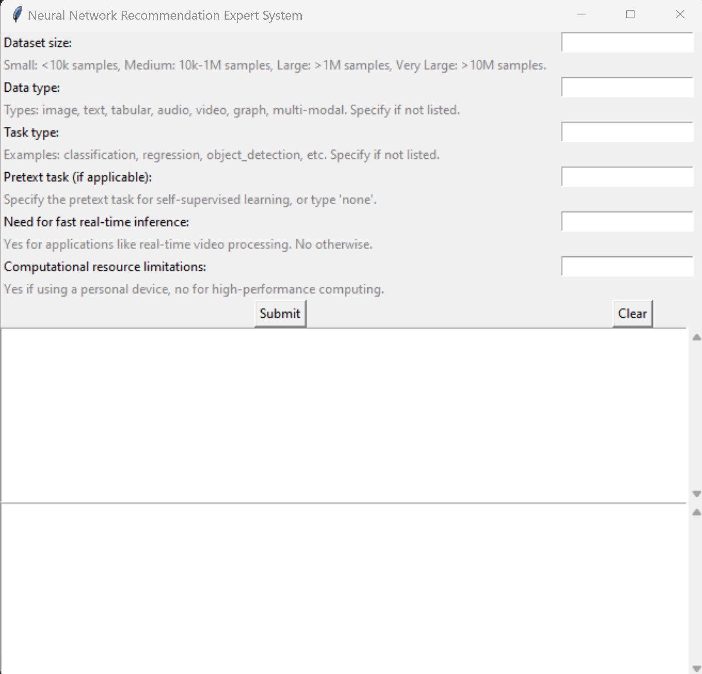
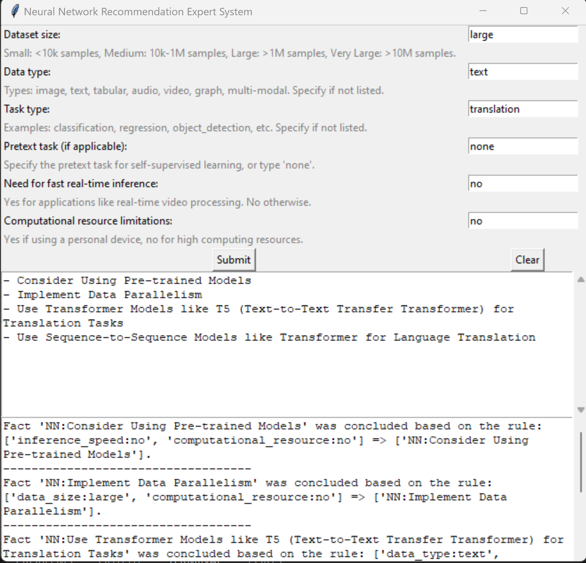

# Neural-Expert

## Author:

KABOURI Mohamed Yassine <mkabouri@bordeaux-inp.fr>

## Motivation:

This project aims to provide recommendations for selecting appropriate neural network architectures based on various input parameters such as dataset size, data type, task type, and computational resources. It leverages an expert system with predefined rules to suggest neural network models that are suitable for specific scenarios.

## Description:

The Neural Expert is designed to assist users in making informed decisions when choosing neural network architectures for their deep learning projects. By inputting key parameters related to their datasets and tasks, users can receive tailored recommendations for neural network models. The system uses predefined rules to make these recommendations.

## Commands:

The expert system can be run in two different interfaces: a terminal-based interface and a graphical user interface (GUI).

To run the terminal interface, use the following command:
```
python3 .\run.py --interface terminal
```

To launch the graphical user interface (Tkinter-based), use the following command:
```
python3 .\run.py --interface tkinter
```

## User Interface:

### Terminal Interface:
- The terminal interface allows users to input information about their datasets and tasks using a command-line interface.
- Users will answer a series of questions about dataset size, data type, task type, and other factors.
- The system will provide recommendations for neural network architectures based on user inputs.

### Graphical User Interface (Tkinter):
- The GUI interface offers a user-friendly way to input parameters and receive recommendations.
- Users will provide information about their datasets and tasks using a graphical form.
- Recommendations for neural network architectures will be displayed within the GUI.

#### GUI demo:
This how the tkinter interface looks like:

| Before                     | After                      |
|----------------------------|----------------------------|
|  |  |


## References:

- Main reference: [Papers with Code](https://paperswithcode.com/)
- [Expert System Paper](https://arxiv.org/pdf/1812.08434.pdf)
- [Another Reference](https://arxiv.org/abs/2304.12210)

## Contribution:

Contributions to this project are welcome. If you have rules to add, suggestions, bug fixes, or enhancements, feel free to contribute.